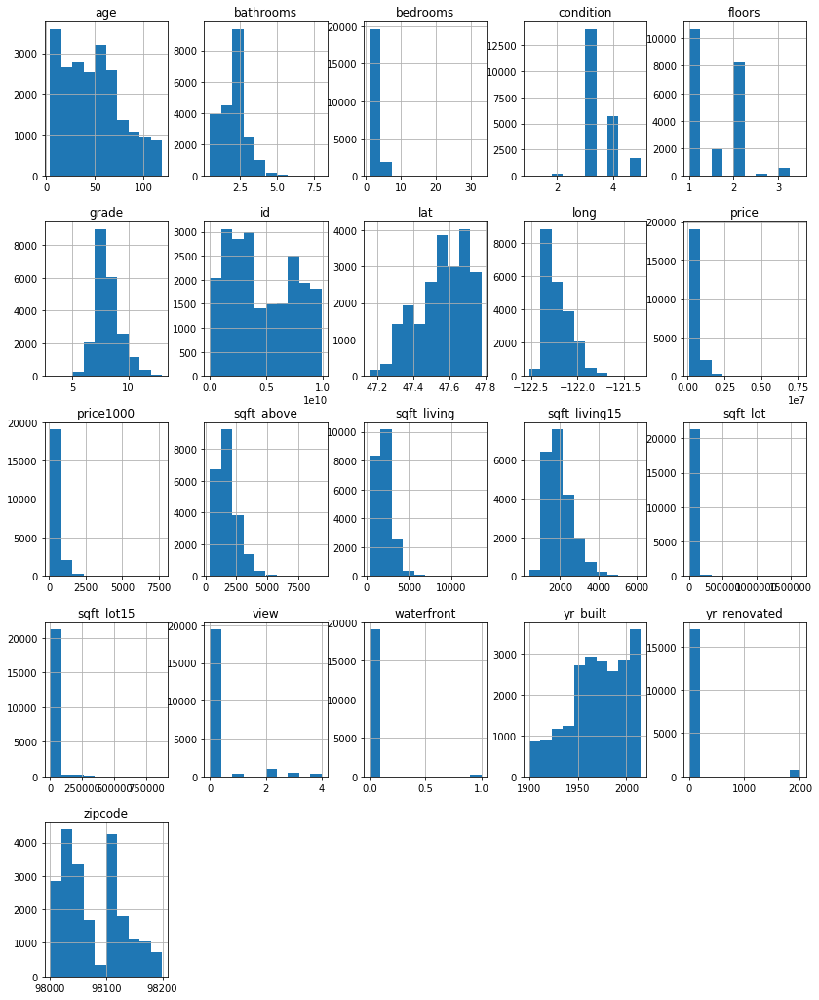
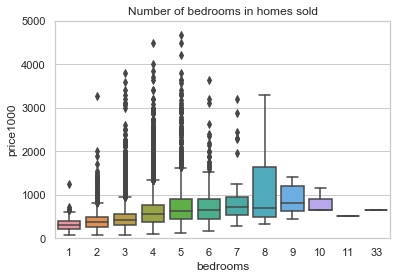
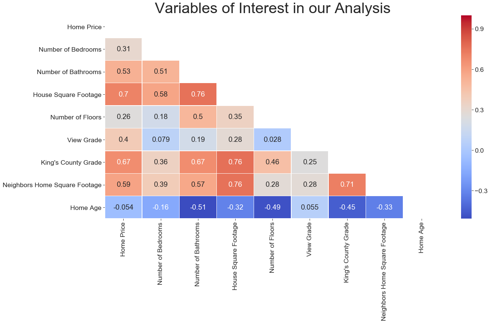
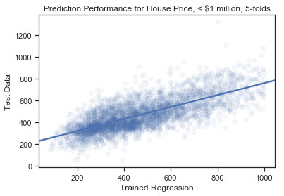
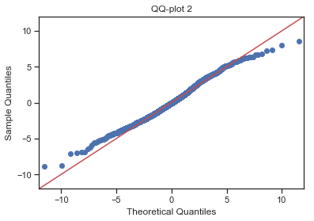

# Kings County Housing Data Analysis:
## Linear regression prediction of housing prices secondary to housing characteristics 


### Packages utilized for this analysis are as follows:


```python
#Import Packages
import matplotlib.pyplot as plt
%matplotlib inline
import numpy as np
import pandas as pd
import pylab 
import scipy.stats as stats
import seaborn as sns
import sklearn as sk
from sklearn.linear_model import  LinearRegression
from sklearn.model_selection import *
from sklearn import metrics
import statsmodels.api as sm
import statsmodels.formula.api as smf
```

### Orginial Dataset 


```python
#Original Dataset
df = pd.read_csv('kc_house_data.csv')
```

### Data Analysis
On inspection of raw data, the following was noted:
* Out of 23 data columns, 3 contained null values
    * waterfront, view, and yr.renovated
* the id column contained numerous duplications
* the lat column consisted of inconsistent decimal significant figures
* the sqft_basement column contained a significant numner of "?" in place of numerical data
* Several columns consisted of categorical data
    * waterfront, view, condition, and grade
* A few significant outliyers
    * One home in the bedroom column had 33 bedrooms
    * One home had 7.5 bathroom


```python
df.head() #view of first 5 rows of data
```


<div>
<style scoped>
    .dataframe tbody tr th:only-of-type {
        vertical-align: middle;
    }

    .dataframe tbody tr th {
        vertical-align: top;
    }

    .dataframe thead th {
        text-align: right;
    }
</style>
<table border="1" class="dataframe">
  <thead>
    <tr style="text-align: right;">
      <th></th>
      <th>id</th>
      <th>date</th>
      <th>price</th>
      <th>bedrooms</th>
      <th>bathrooms</th>
      <th>sqft_living</th>
      <th>sqft_lot</th>
      <th>floors</th>
      <th>waterfront</th>
      <th>view</th>
      <th>...</th>
      <th>grade</th>
      <th>sqft_above</th>
      <th>sqft_basement</th>
      <th>yr_built</th>
      <th>yr_renovated</th>
      <th>zipcode</th>
      <th>lat</th>
      <th>long</th>
      <th>sqft_living15</th>
      <th>sqft_lot15</th>
    </tr>
  </thead>
  <tbody>
    <tr>
      <th>0</th>
      <td>7129300520</td>
      <td>10/13/2014</td>
      <td>221900.0</td>
      <td>3</td>
      <td>1.00</td>
      <td>1180</td>
      <td>5650</td>
      <td>1.0</td>
      <td>NaN</td>
      <td>0.0</td>
      <td>...</td>
      <td>7</td>
      <td>1180</td>
      <td>0.0</td>
      <td>1955</td>
      <td>0.0</td>
      <td>98178</td>
      <td>47.5112</td>
      <td>-122.257</td>
      <td>1340</td>
      <td>5650</td>
    </tr>
    <tr>
      <th>1</th>
      <td>6414100192</td>
      <td>12/9/2014</td>
      <td>538000.0</td>
      <td>3</td>
      <td>2.25</td>
      <td>2570</td>
      <td>7242</td>
      <td>2.0</td>
      <td>0.0</td>
      <td>0.0</td>
      <td>...</td>
      <td>7</td>
      <td>2170</td>
      <td>400.0</td>
      <td>1951</td>
      <td>1991.0</td>
      <td>98125</td>
      <td>47.7210</td>
      <td>-122.319</td>
      <td>1690</td>
      <td>7639</td>
    </tr>
    <tr>
      <th>2</th>
      <td>5631500400</td>
      <td>2/25/2015</td>
      <td>180000.0</td>
      <td>2</td>
      <td>1.00</td>
      <td>770</td>
      <td>10000</td>
      <td>1.0</td>
      <td>0.0</td>
      <td>0.0</td>
      <td>...</td>
      <td>6</td>
      <td>770</td>
      <td>0.0</td>
      <td>1933</td>
      <td>NaN</td>
      <td>98028</td>
      <td>47.7379</td>
      <td>-122.233</td>
      <td>2720</td>
      <td>8062</td>
    </tr>
    <tr>
      <th>3</th>
      <td>2487200875</td>
      <td>12/9/2014</td>
      <td>604000.0</td>
      <td>4</td>
      <td>3.00</td>
      <td>1960</td>
      <td>5000</td>
      <td>1.0</td>
      <td>0.0</td>
      <td>0.0</td>
      <td>...</td>
      <td>7</td>
      <td>1050</td>
      <td>910.0</td>
      <td>1965</td>
      <td>0.0</td>
      <td>98136</td>
      <td>47.5208</td>
      <td>-122.393</td>
      <td>1360</td>
      <td>5000</td>
    </tr>
    <tr>
      <th>4</th>
      <td>1954400510</td>
      <td>2/18/2015</td>
      <td>510000.0</td>
      <td>3</td>
      <td>2.00</td>
      <td>1680</td>
      <td>8080</td>
      <td>1.0</td>
      <td>0.0</td>
      <td>0.0</td>
      <td>...</td>
      <td>8</td>
      <td>1680</td>
      <td>0.0</td>
      <td>1987</td>
      <td>0.0</td>
      <td>98074</td>
      <td>47.6168</td>
      <td>-122.045</td>
      <td>1800</td>
      <td>7503</td>
    </tr>
  </tbody>
</table>
<p>5 rows × 21 columns</p>
</div>


```python
df.info()
```

    <class 'pandas.core.frame.DataFrame'>
    RangeIndex: 21597 entries, 0 to 21596
    Data columns (total 21 columns):
    id               21597 non-null int64
    date             21597 non-null object
    price            21597 non-null float64
    bedrooms         21597 non-null int64
    bathrooms        21597 non-null float64
    sqft_living      21597 non-null int64
    sqft_lot         21597 non-null int64
    floors           21597 non-null float64
    waterfront       19221 non-null float64
    view             21534 non-null float64
    condition        21597 non-null int64
    grade            21597 non-null int64
    sqft_above       21597 non-null int64
    sqft_basement    21597 non-null object
    yr_built         21597 non-null int64
    yr_renovated     17755 non-null float64
    zipcode          21597 non-null int64
    lat              21597 non-null float64
    long             21597 non-null float64
    sqft_living15    21597 non-null int64
    sqft_lot15       21597 non-null int64
    dtypes: float64(8), int64(11), object(2)
    memory usage: 3.5+ MB


```python
df.info()
```

    <class 'pandas.core.frame.DataFrame'>
    RangeIndex: 21597 entries, 0 to 21596
    Data columns (total 21 columns):
    id               21597 non-null int64
    date             21597 non-null object
    price            21597 non-null float64
    bedrooms         21597 non-null int64
    bathrooms        21597 non-null float64
    sqft_living      21597 non-null int64
    sqft_lot         21597 non-null int64
    floors           21597 non-null float64
    waterfront       19221 non-null float64
    view             21534 non-null float64
    condition        21597 non-null int64
    grade            21597 non-null int64
    sqft_above       21597 non-null int64
    sqft_basement    21597 non-null object
    yr_built         21597 non-null int64
    yr_renovated     17755 non-null float64
    zipcode          21597 non-null int64
    lat              21597 non-null float64
    long             21597 non-null float64
    sqft_living15    21597 non-null int64
    sqft_lot15       21597 non-null int64
    dtypes: float64(8), int64(11), object(2)
    memory usage: 3.5+ MB


```python
df.columns
```


    Index(['id', 'date', 'price', 'bedrooms', 'bathrooms', 'sqft_living',
           'sqft_lot', 'floors', 'waterfront', 'view', 'condition', 'grade',
           'sqft_above', 'sqft_basement', 'yr_built', 'yr_renovated', 'zipcode',
           'lat', 'long', 'sqft_living15', 'sqft_lot15'],
          dtype='object')


### Dataset cleaning prior to analysis:


```python
# All "?" in sqft_basement column replaced with null values
df = df.replace('?' , np.nan)

# A new data column was created by taking each value in 
#'yr_built' and subtracting from the current year 2019
df['age'] = 2019-df['yr_built']

#In order to provide more manageable values, 'price was divided by 1000, 
# converting 'price' to thousands ($)
df['price1000'] = df['price']/1000

#Due to the large spread of data, and the substantially increased variance 
# as 'price' approached millions, the dataset 'price' was capped at 
# 1,000,000 ie 'price' would include only homes valued at under 1 million dollars
df_Mill = df.loc[df['price'] < 1000000]
df_Mill.describe()


#Columns of interest for <$1,000,000 Homes
dfX= df_Mill[['sqft_living', 'bathrooms', 'floors', 'grade'
              , 'sqft_living15', 'age', 'zipcode', 'view']]
dfY= df_Mill['price1000']

#Dataframe with Dummy Variables
dfXDummy1 = pd.get_dummies(dfX, columns=['view','zipcode'])
dfXDummy1 = dfXDummy1.drop(['view_0.0','zipcode_98001'], axis=1)
dfXDummy1.head()

#####Most relevant zipcodes
relevant_zip = dfXDummy1[['zipcode_98040', 'zipcode_98004', 'zipcode_98039', 
                          'zipcode_98005', 'zipcode_98075', 'zipcode_98112', 
                          'zipcode_98119', 'zipcode_98006', 'zipcode_98109', 
                          'zipcode_98102', 'zipcode_98074', 'zipcode_98105', 
                          'zipcode_98199', 'zipcode_98033', 'zipcode_98077', 'zipcode_98052', 'zipcode_98053']]
relevant_zip.head()

#######Final Data
X= dfXDummy1[['sqft_living', 'bathrooms', 'floors', 'grade', 
              'sqft_living15', 'age']]
Y= dfY
```

### Preliminary Normality Check


```python
df.hist(figsize=(14,18))
```


    array([[<matplotlib.axes._subplots.AxesSubplot object at 0x1a1676a5c0>,
            <matplotlib.axes._subplots.AxesSubplot object at 0x1a1765d198>,
            <matplotlib.axes._subplots.AxesSubplot object at 0x1a17684400>,
            <matplotlib.axes._subplots.AxesSubplot object at 0x1a17717668>,
            <matplotlib.axes._subplots.AxesSubplot object at 0x1a175f6898>],
           [<matplotlib.axes._subplots.AxesSubplot object at 0x1a1761eb00>,
            <matplotlib.axes._subplots.AxesSubplot object at 0x1a18161d68>,
            <matplotlib.axes._subplots.AxesSubplot object at 0x1c1879ffd0>,
            <matplotlib.axes._subplots.AxesSubplot object at 0x1c187a6080>,
            <matplotlib.axes._subplots.AxesSubplot object at 0x1c187f84e0>],
           [<matplotlib.axes._subplots.AxesSubplot object at 0x1c1881f748>,
            <matplotlib.axes._subplots.AxesSubplot object at 0x1c188489b0>,
            <matplotlib.axes._subplots.AxesSubplot object at 0x1c18870c18>,
            <matplotlib.axes._subplots.AxesSubplot object at 0x1c1889ae80>,
            <matplotlib.axes._subplots.AxesSubplot object at 0x1c188cd128>],
           [<matplotlib.axes._subplots.AxesSubplot object at 0x1c188f4390>,
            <matplotlib.axes._subplots.AxesSubplot object at 0x1c1891f5f8>,
            <matplotlib.axes._subplots.AxesSubplot object at 0x1c18947860>,
            <matplotlib.axes._subplots.AxesSubplot object at 0x1c18971ac8>,
            <matplotlib.axes._subplots.AxesSubplot object at 0x1c18999d30>],
           [<matplotlib.axes._subplots.AxesSubplot object at 0x1c189c5f98>,
            <matplotlib.axes._subplots.AxesSubplot object at 0x1c189f4240>,
            <matplotlib.axes._subplots.AxesSubplot object at 0x1c18a1d4a8>,
            <matplotlib.axes._subplots.AxesSubplot object at 0x1c18a47710>,
            <matplotlib.axes._subplots.AxesSubplot object at 0x1c18a6f978>]],
          dtype=object)





### Box plot illustrating outliers such as a house with 33 bedrooms


```python
sns.set(style="whitegrid")
sns.boxplot(x=df["bedrooms"],y=df["price1000"])
plt.ylim(0, 5000)
plt.title("Number of bedrooms in homes sold")
```


    Text(0.5, 1.0, 'Number of bedrooms in homes sold')





### Visual inspection of predictor multicollinearity via heatmap 


```python
corr = new_data.corr()
plt.figure(figsize=(20,10))
mask = np.zeros_like(corr, dtype=np.bool)
mask[np.triu_indices_from(mask)] = True
sns.set_context("paper", font_scale=2)
plt.title('Variables of Interest in our Analysis', fontsize=40)
sns.heatmap(new_data.corr(),annot=True, linewidth=.5, cmap="coolwarm", mask=mask)
```


    <matplotlib.axes._subplots.AxesSubplot at 0x1c1c20fe48>





```python
new_data = df.rename(columns = {'price': "Home Price", 'bedrooms': "Number of Bedrooms", 'bathrooms': "Number of Bathrooms", 
                                             'sqft_living': "House Square Footage", 'floors': "Number of Floors", 'view': "View Grade", 'grade' : "King's County Grade", 'sqft_living15' : "Neighbors Home Square Footage", 'age' : "Home Age"})
new_data = new_data.drop(['sqft_lot', 'id', 'waterfront', 'condition', 'sqft_above', 'yr_built', 'yr_renovated', 'zipcode', 'lat', 'long', 'sqft_lot15', 'price1000'], axis=1)
```

### Running the regression model

From our regression model, with 'price1000' as the dependent/target variable and explanatory variables of 'sqft_living', 'bedrooms', 'bathrooms', 'floors', 'sqft_lot', 'grade', 'sqft_living15', 'sqft_lot15', 'age',
we obtained an R squared value was 0.551. 


```python
#Regression Model
X = sm.add_constant(X)# adding a constant
model=sm.OLS(Y, X).fit()
model.summary()
```


<table class="simpletable">
<caption>OLS Regression Results</caption>
<tr>
  <th>Dep. Variable:</th>        <td>price1000</td>    <th>  R-squared:         </th>  <td>   0.548</td>  
</tr>
<tr>
  <th>Model:</th>                   <td>OLS</td>       <th>  Adj. R-squared:    </th>  <td>   0.548</td>  
</tr>
<tr>
  <th>Method:</th>             <td>Least Squares</td>  <th>  F-statistic:       </th>  <td>   4058.</td>  
</tr>
<tr>
  <th>Date:</th>             <td>Fri, 10 May 2019</td> <th>  Prob (F-statistic):</th>   <td>  0.00</td>   
</tr>
<tr>
  <th>Time:</th>                 <td>14:07:09</td>     <th>  Log-Likelihood:    </th> <td>-1.2663e+05</td>
</tr>
<tr>
  <th>No. Observations:</th>      <td> 20107</td>      <th>  AIC:               </th>  <td>2.533e+05</td> 
</tr>
<tr>
  <th>Df Residuals:</th>          <td> 20100</td>      <th>  BIC:               </th>  <td>2.533e+05</td> 
</tr>
<tr>
  <th>Df Model:</th>              <td>     6</td>      <th>                     </th>      <td> </td>     
</tr>
<tr>
  <th>Covariance Type:</th>      <td>nonrobust</td>    <th>                     </th>      <td> </td>     
</tr>
</table>
<table class="simpletable">
<tr>
        <td></td>           <th>coef</th>     <th>std err</th>      <th>t</th>      <th>P>|t|</th>  <th>[0.025</th>    <th>0.975]</th>  
</tr>
<tr>
  <th>const</th>         <td> -663.4939</td> <td>    9.899</td> <td>  -67.026</td> <td> 0.000</td> <td> -682.897</td> <td> -644.091</td>
</tr>
<tr>
  <th>sqft_living</th>   <td>    0.0511</td> <td>    0.002</td> <td>   22.061</td> <td> 0.000</td> <td>    0.047</td> <td>    0.056</td>
</tr>
<tr>
  <th>bathrooms</th>     <td>   29.7995</td> <td>    2.182</td> <td>   13.655</td> <td> 0.000</td> <td>   25.522</td> <td>   34.077</td>
</tr>
<tr>
  <th>floors</th>        <td>   39.1622</td> <td>    2.166</td> <td>   18.081</td> <td> 0.000</td> <td>   34.917</td> <td>   43.408</td>
</tr>
<tr>
  <th>grade</th>         <td>   89.8342</td> <td>    1.465</td> <td>   61.333</td> <td> 0.000</td> <td>   86.963</td> <td>   92.705</td>
</tr>
<tr>
  <th>sqft_living15</th> <td>    0.0541</td> <td>    0.002</td> <td>   22.374</td> <td> 0.000</td> <td>    0.049</td> <td>    0.059</td>
</tr>
<tr>
  <th>age</th>           <td>    2.8027</td> <td>    0.042</td> <td>   66.566</td> <td> 0.000</td> <td>    2.720</td> <td>    2.885</td>
</tr>
</table>
<table class="simpletable">
<tr>
  <th>Omnibus:</th>       <td>431.653</td> <th>  Durbin-Watson:     </th> <td>   1.959</td> 
</tr>
<tr>
  <th>Prob(Omnibus):</th> <td> 0.000</td>  <th>  Jarque-Bera (JB):  </th> <td> 490.746</td> 
</tr>
<tr>
  <th>Skew:</th>          <td> 0.323</td>  <th>  Prob(JB):          </th> <td>2.73e-107</td>
</tr>
<tr>
  <th>Kurtosis:</th>      <td> 3.411</td>  <th>  Cond. No.          </th> <td>3.09e+04</td> 
</tr>
</table><br/><br/>Warnings:<br/>[1] Standard Errors assume that the covariance matrix of the errors is correctly specified.<br/>[2] The condition number is large, 3.09e+04. This might indicate that there are<br/>strong multicollinearity or other numerical problems.


Note: Our Model ran with all explanatory variables in the X dataframe, and the target variable (House price in thousands of dollars) in the Y dataframe. All explanatory variables are significant.

### Testing Distribution of Residuals
A Q-Q plot was done, illustrating that our model residuals were normally distributed and the assumptions required for our model to be reliable were met.


```python
#Residual Plot
residuals = model.resid
fig = sm.qqplot(residuals, stats.t, fit=True, line='45')
plt.show()
```


### Training and testing the data

We performed a 5-fold split of our dataset with 80% of the data in training and 20% of the data in testing.


```python
#Train and test
X_train, X_test, Y_train, Y_test = train_test_split(X, Y, test_size=0.2)

lm = LinearRegression()
model = lm.fit(X_train, Y_train)
predictions = lm.predict(X_test)

lm.score(X_train, Y_train)
```


    0.5478371888662472


### Predicted Performance of House Sale Price

Below is a visualization of our prediction line from the training data compared to the testing data.


```python
sns.set(style='ticks')
sns.regplot(Y_test, y=predictions, scatter_kws={'alpha':0.05});
plt.title('Prediction Performance for House Price, < $1 million, 5-folds')
plt.ylabel('Test Data')
plt.xlabel('Trained Regression')
```

    /anaconda3/lib/python3.7/site-packages/scipy/stats/stats.py:1713: FutureWarning: Using a non-tuple sequence for multidimensional indexing is deprecated; use `arr[tuple(seq)]` instead of `arr[seq]`. In the future this will be interpreted as an array index, `arr[np.array(seq)]`, which will result either in an error or a different result.
      return np.add.reduce(sorted[indexer] * weights, axis=axis) / sumval


    Text(0.5, 0, 'Trained Regression')





We used Root Mean Squared Error to evaluate model performance.  On average, our trained regression model mis-estimated the true values of homes in the test data by $131,000.


```python
#On Average our model missed each data point by $131,000
metrics.mean_squared_error(Y_test, predictions)**0.5
```


    130.42073232092025


```python
MSEs = cross_val_score(lm, X, y=Y, scoring='neg_mean_squared_error', cv=10)
RMSE = (MSEs*-1)**0.5
print(RMSE)
```

    [131.86508051 134.14601432 133.83294761 129.96903792 129.35030657
     128.62966488 131.03051626 133.22863926 132.86070996 135.89446624]


### Regression Analysis with categorical values
Our linear regression model was repeated, but this time with the inclusion of categorical variables (view and zipcode) via dummy variables


```python
dfXDummy1.shape
```


    (20107, 79)


```python
X1= dfXDummy1
Y1= dfY

X1 = sm.add_constant(X1)# adding a constant
model1=sm.OLS(Y, X1).fit()
model1.summary()
```


<table class="simpletable">
<caption>OLS Regression Results</caption>
<tr>
  <th>Dep. Variable:</th>        <td>price1000</td>    <th>  R-squared:         </th>  <td>   0.819</td>  
</tr>
<tr>
  <th>Model:</th>                   <td>OLS</td>       <th>  Adj. R-squared:    </th>  <td>   0.818</td>  
</tr>
<tr>
  <th>Method:</th>             <td>Least Squares</td>  <th>  F-statistic:       </th>  <td>   1147.</td>  
</tr>
<tr>
  <th>Date:</th>             <td>Fri, 10 May 2019</td> <th>  Prob (F-statistic):</th>   <td>  0.00</td>   
</tr>
<tr>
  <th>Time:</th>                 <td>14:07:14</td>     <th>  Log-Likelihood:    </th> <td>-1.1742e+05</td>
</tr>
<tr>
  <th>No. Observations:</th>      <td> 20107</td>      <th>  AIC:               </th>  <td>2.350e+05</td> 
</tr>
<tr>
  <th>Df Residuals:</th>          <td> 20027</td>      <th>  BIC:               </th>  <td>2.356e+05</td> 
</tr>
<tr>
  <th>Df Model:</th>              <td>    79</td>      <th>                     </th>      <td> </td>     
</tr>
<tr>
  <th>Covariance Type:</th>      <td>nonrobust</td>    <th>                     </th>      <td> </td>     
</tr>
</table>
<table class="simpletable">
<tr>
        <td></td>           <th>coef</th>     <th>std err</th>      <th>t</th>      <th>P>|t|</th>  <th>[0.025</th>    <th>0.975]</th>  
</tr>
<tr>
  <th>const</th>         <td> -351.9106</td> <td>    8.071</td> <td>  -43.601</td> <td> 0.000</td> <td> -367.731</td> <td> -336.091</td>
</tr>
<tr>
  <th>sqft_living</th>   <td>    0.0891</td> <td>    0.002</td> <td>   59.021</td> <td> 0.000</td> <td>    0.086</td> <td>    0.092</td>
</tr>
<tr>
  <th>bathrooms</th>     <td>   10.4835</td> <td>    1.406</td> <td>    7.456</td> <td> 0.000</td> <td>    7.727</td> <td>   13.240</td>
</tr>
<tr>
  <th>floors</th>        <td>    0.0086</td> <td>    1.498</td> <td>    0.006</td> <td> 0.995</td> <td>   -2.927</td> <td>    2.944</td>
</tr>
<tr>
  <th>grade</th>         <td>   46.4428</td> <td>    0.996</td> <td>   46.627</td> <td> 0.000</td> <td>   44.490</td> <td>   48.395</td>
</tr>
<tr>
  <th>sqft_living15</th> <td>    0.0381</td> <td>    0.002</td> <td>   22.747</td> <td> 0.000</td> <td>    0.035</td> <td>    0.041</td>
</tr>
<tr>
  <th>age</th>           <td>    0.8152</td> <td>    0.033</td> <td>   25.070</td> <td> 0.000</td> <td>    0.751</td> <td>    0.879</td>
</tr>
<tr>
  <th>view_1.0</th>      <td>   47.4121</td> <td>    5.334</td> <td>    8.888</td> <td> 0.000</td> <td>   36.956</td> <td>   57.868</td>
</tr>
<tr>
  <th>view_2.0</th>      <td>   49.1039</td> <td>    3.200</td> <td>   15.345</td> <td> 0.000</td> <td>   42.832</td> <td>   55.376</td>
</tr>
<tr>
  <th>view_3.0</th>      <td>   71.8240</td> <td>    4.838</td> <td>   14.845</td> <td> 0.000</td> <td>   62.341</td> <td>   81.307</td>
</tr>
<tr>
  <th>view_4.0</th>      <td>  173.6434</td> <td>    7.622</td> <td>   22.782</td> <td> 0.000</td> <td>  158.704</td> <td>  188.583</td>
</tr>
<tr>
  <th>zipcode_98002</th> <td>   12.6631</td> <td>    7.378</td> <td>    1.716</td> <td> 0.086</td> <td>   -1.799</td> <td>   27.125</td>
</tr>
<tr>
  <th>zipcode_98003</th> <td>   -9.1416</td> <td>    6.648</td> <td>   -1.375</td> <td> 0.169</td> <td>  -22.172</td> <td>    3.889</td>
</tr>
<tr>
  <th>zipcode_98004</th> <td>  476.4774</td> <td>    8.501</td> <td>   56.049</td> <td> 0.000</td> <td>  459.815</td> <td>  493.140</td>
</tr>
<tr>
  <th>zipcode_98005</th> <td>  317.3658</td> <td>    8.287</td> <td>   38.297</td> <td> 0.000</td> <td>  301.123</td> <td>  333.609</td>
</tr>
<tr>
  <th>zipcode_98006</th> <td>  261.1887</td> <td>    6.194</td> <td>   42.170</td> <td> 0.000</td> <td>  249.049</td> <td>  273.329</td>
</tr>
<tr>
  <th>zipcode_98007</th> <td>  247.3902</td> <td>    8.458</td> <td>   29.248</td> <td> 0.000</td> <td>  230.811</td> <td>  263.970</td>
</tr>
<tr>
  <th>zipcode_98008</th> <td>  234.0668</td> <td>    6.780</td> <td>   34.526</td> <td> 0.000</td> <td>  220.778</td> <td>  247.355</td>
</tr>
<tr>
  <th>zipcode_98010</th> <td>  108.7740</td> <td>    9.424</td> <td>   11.542</td> <td> 0.000</td> <td>   90.303</td> <td>  127.246</td>
</tr>
<tr>
  <th>zipcode_98011</th> <td>  137.0527</td> <td>    7.440</td> <td>   18.422</td> <td> 0.000</td> <td>  122.471</td> <td>  151.635</td>
</tr>
<tr>
  <th>zipcode_98014</th> <td>  131.2463</td> <td>    8.759</td> <td>   14.985</td> <td> 0.000</td> <td>  114.079</td> <td>  148.414</td>
</tr>
<tr>
  <th>zipcode_98019</th> <td>  106.2619</td> <td>    7.499</td> <td>   14.170</td> <td> 0.000</td> <td>   91.563</td> <td>  120.961</td>
</tr>
<tr>
  <th>zipcode_98022</th> <td>   28.6355</td> <td>    7.037</td> <td>    4.069</td> <td> 0.000</td> <td>   14.842</td> <td>   42.429</td>
</tr>
<tr>
  <th>zipcode_98023</th> <td>  -25.1245</td> <td>    5.773</td> <td>   -4.352</td> <td> 0.000</td> <td>  -36.440</td> <td>  -13.809</td>
</tr>
<tr>
  <th>zipcode_98024</th> <td>  166.8150</td> <td>   10.765</td> <td>   15.496</td> <td> 0.000</td> <td>  145.714</td> <td>  187.916</td>
</tr>
<tr>
  <th>zipcode_98027</th> <td>  191.0343</td> <td>    6.121</td> <td>   31.210</td> <td> 0.000</td> <td>  179.037</td> <td>  203.032</td>
</tr>
<tr>
  <th>zipcode_98028</th> <td>  125.9201</td> <td>    6.648</td> <td>   18.942</td> <td> 0.000</td> <td>  112.890</td> <td>  138.950</td>
</tr>
<tr>
  <th>zipcode_98029</th> <td>  224.3133</td> <td>    6.522</td> <td>   34.395</td> <td> 0.000</td> <td>  211.530</td> <td>  237.096</td>
</tr>
<tr>
  <th>zipcode_98030</th> <td>    4.7181</td> <td>    6.813</td> <td>    0.692</td> <td> 0.489</td> <td>   -8.636</td> <td>   18.073</td>
</tr>
<tr>
  <th>zipcode_98031</th> <td>   11.8622</td> <td>    6.689</td> <td>    1.773</td> <td> 0.076</td> <td>   -1.249</td> <td>   24.974</td>
</tr>
<tr>
  <th>zipcode_98032</th> <td>  -11.1297</td> <td>    8.661</td> <td>   -1.285</td> <td> 0.199</td> <td>  -28.107</td> <td>    5.847</td>
</tr>
<tr>
  <th>zipcode_98033</th> <td>  305.6161</td> <td>    6.307</td> <td>   48.458</td> <td> 0.000</td> <td>  293.254</td> <td>  317.978</td>
</tr>
<tr>
  <th>zipcode_98034</th> <td>  177.8213</td> <td>    5.714</td> <td>   31.119</td> <td> 0.000</td> <td>  166.621</td> <td>  189.021</td>
</tr>
<tr>
  <th>zipcode_98038</th> <td>   46.6946</td> <td>    5.602</td> <td>    8.335</td> <td> 0.000</td> <td>   35.714</td> <td>   57.675</td>
</tr>
<tr>
  <th>zipcode_98039</th> <td>  630.6376</td> <td>   37.552</td> <td>   16.794</td> <td> 0.000</td> <td>  557.032</td> <td>  704.243</td>
</tr>
<tr>
  <th>zipcode_98040</th> <td>  400.0434</td> <td>    8.270</td> <td>   48.375</td> <td> 0.000</td> <td>  383.834</td> <td>  416.253</td>
</tr>
<tr>
  <th>zipcode_98042</th> <td>   17.9354</td> <td>    5.656</td> <td>    3.171</td> <td> 0.002</td> <td>    6.849</td> <td>   29.022</td>
</tr>
<tr>
  <th>zipcode_98045</th> <td>  116.4758</td> <td>    7.185</td> <td>   16.211</td> <td> 0.000</td> <td>  102.393</td> <td>  130.559</td>
</tr>
<tr>
  <th>zipcode_98052</th> <td>  249.7555</td> <td>    5.684</td> <td>   43.942</td> <td> 0.000</td> <td>  238.615</td> <td>  260.896</td>
</tr>
<tr>
  <th>zipcode_98053</th> <td>  248.7953</td> <td>    6.206</td> <td>   40.093</td> <td> 0.000</td> <td>  236.632</td> <td>  260.959</td>
</tr>
<tr>
  <th>zipcode_98055</th> <td>   34.3812</td> <td>    6.729</td> <td>    5.109</td> <td> 0.000</td> <td>   21.191</td> <td>   47.571</td>
</tr>
<tr>
  <th>zipcode_98056</th> <td>  107.3387</td> <td>    6.047</td> <td>   17.751</td> <td> 0.000</td> <td>   95.486</td> <td>  119.191</td>
</tr>
<tr>
  <th>zipcode_98058</th> <td>   39.4726</td> <td>    5.888</td> <td>    6.704</td> <td> 0.000</td> <td>   27.932</td> <td>   51.013</td>
</tr>
<tr>
  <th>zipcode_98059</th> <td>  105.9001</td> <td>    5.939</td> <td>   17.832</td> <td> 0.000</td> <td>   94.260</td> <td>  117.541</td>
</tr>
<tr>
  <th>zipcode_98065</th> <td>  132.5385</td> <td>    6.578</td> <td>   20.149</td> <td> 0.000</td> <td>  119.646</td> <td>  145.432</td>
</tr>
<tr>
  <th>zipcode_98070</th> <td>  159.7169</td> <td>    8.999</td> <td>   17.748</td> <td> 0.000</td> <td>  142.078</td> <td>  177.356</td>
</tr>
<tr>
  <th>zipcode_98072</th> <td>  174.6230</td> <td>    6.819</td> <td>   25.607</td> <td> 0.000</td> <td>  161.256</td> <td>  187.990</td>
</tr>
<tr>
  <th>zipcode_98074</th> <td>  214.0568</td> <td>    6.087</td> <td>   35.164</td> <td> 0.000</td> <td>  202.125</td> <td>  225.988</td>
</tr>
<tr>
  <th>zipcode_98075</th> <td>  236.3458</td> <td>    6.564</td> <td>   36.007</td> <td> 0.000</td> <td>  223.480</td> <td>  249.212</td>
</tr>
<tr>
  <th>zipcode_98077</th> <td>  188.3671</td> <td>    7.669</td> <td>   24.562</td> <td> 0.000</td> <td>  173.335</td> <td>  203.399</td>
</tr>
<tr>
  <th>zipcode_98092</th> <td>   -6.0001</td> <td>    6.262</td> <td>   -0.958</td> <td> 0.338</td> <td>  -18.273</td> <td>    6.273</td>
</tr>
<tr>
  <th>zipcode_98102</th> <td>  354.6796</td> <td>   10.376</td> <td>   34.182</td> <td> 0.000</td> <td>  334.341</td> <td>  375.018</td>
</tr>
<tr>
  <th>zipcode_98103</th> <td>  290.8573</td> <td>    5.780</td> <td>   50.323</td> <td> 0.000</td> <td>  279.528</td> <td>  302.186</td>
</tr>
<tr>
  <th>zipcode_98105</th> <td>  337.4468</td> <td>    7.900</td> <td>   42.712</td> <td> 0.000</td> <td>  321.961</td> <td>  352.932</td>
</tr>
<tr>
  <th>zipcode_98106</th> <td>  103.7352</td> <td>    6.364</td> <td>   16.301</td> <td> 0.000</td> <td>   91.262</td> <td>  116.209</td>
</tr>
<tr>
  <th>zipcode_98107</th> <td>  295.0762</td> <td>    6.908</td> <td>   42.718</td> <td> 0.000</td> <td>  281.537</td> <td>  308.616</td>
</tr>
<tr>
  <th>zipcode_98108</th> <td>   97.3486</td> <td>    7.561</td> <td>   12.875</td> <td> 0.000</td> <td>   82.529</td> <td>  112.169</td>
</tr>
<tr>
  <th>zipcode_98109</th> <td>  366.5413</td> <td>   10.366</td> <td>   35.360</td> <td> 0.000</td> <td>  346.223</td> <td>  386.860</td>
</tr>
<tr>
  <th>zipcode_98112</th> <td>  369.8744</td> <td>    8.256</td> <td>   44.803</td> <td> 0.000</td> <td>  353.693</td> <td>  386.056</td>
</tr>
<tr>
  <th>zipcode_98115</th> <td>  292.3780</td> <td>    5.751</td> <td>   50.837</td> <td> 0.000</td> <td>  281.105</td> <td>  303.651</td>
</tr>
<tr>
  <th>zipcode_98116</th> <td>  267.8100</td> <td>    6.588</td> <td>   40.648</td> <td> 0.000</td> <td>  254.896</td> <td>  280.724</td>
</tr>
<tr>
  <th>zipcode_98117</th> <td>  288.1988</td> <td>    5.798</td> <td>   49.707</td> <td> 0.000</td> <td>  276.834</td> <td>  299.563</td>
</tr>
<tr>
  <th>zipcode_98118</th> <td>  141.1640</td> <td>    5.830</td> <td>   24.214</td> <td> 0.000</td> <td>  129.737</td> <td>  152.591</td>
</tr>
<tr>
  <th>zipcode_98119</th> <td>  361.5467</td> <td>    8.327</td> <td>   43.421</td> <td> 0.000</td> <td>  345.226</td> <td>  377.867</td>
</tr>
<tr>
  <th>zipcode_98122</th> <td>  276.8193</td> <td>    6.883</td> <td>   40.221</td> <td> 0.000</td> <td>  263.329</td> <td>  290.310</td>
</tr>
<tr>
  <th>zipcode_98125</th> <td>  178.2824</td> <td>    6.090</td> <td>   29.275</td> <td> 0.000</td> <td>  166.346</td> <td>  190.219</td>
</tr>
<tr>
  <th>zipcode_98126</th> <td>  175.7309</td> <td>    6.332</td> <td>   27.753</td> <td> 0.000</td> <td>  163.320</td> <td>  188.142</td>
</tr>
<tr>
  <th>zipcode_98133</th> <td>  140.9221</td> <td>    5.808</td> <td>   24.263</td> <td> 0.000</td> <td>  129.538</td> <td>  152.306</td>
</tr>
<tr>
  <th>zipcode_98136</th> <td>  230.0131</td> <td>    6.938</td> <td>   33.153</td> <td> 0.000</td> <td>  216.414</td> <td>  243.612</td>
</tr>
<tr>
  <th>zipcode_98144</th> <td>  212.5596</td> <td>    6.531</td> <td>   32.545</td> <td> 0.000</td> <td>  199.758</td> <td>  225.361</td>
</tr>
<tr>
  <th>zipcode_98146</th> <td>   97.0609</td> <td>    6.673</td> <td>   14.546</td> <td> 0.000</td> <td>   83.981</td> <td>  110.140</td>
</tr>
<tr>
  <th>zipcode_98148</th> <td>   45.0351</td> <td>   11.890</td> <td>    3.788</td> <td> 0.000</td> <td>   21.730</td> <td>   68.340</td>
</tr>
<tr>
  <th>zipcode_98155</th> <td>  129.8014</td> <td>    5.943</td> <td>   21.839</td> <td> 0.000</td> <td>  118.152</td> <td>  141.451</td>
</tr>
<tr>
  <th>zipcode_98166</th> <td>   97.8556</td> <td>    6.953</td> <td>   14.074</td> <td> 0.000</td> <td>   84.227</td> <td>  111.484</td>
</tr>
<tr>
  <th>zipcode_98168</th> <td>   33.5840</td> <td>    6.756</td> <td>    4.971</td> <td> 0.000</td> <td>   20.341</td> <td>   46.827</td>
</tr>
<tr>
  <th>zipcode_98177</th> <td>  198.6020</td> <td>    7.129</td> <td>   27.860</td> <td> 0.000</td> <td>  184.629</td> <td>  212.575</td>
</tr>
<tr>
  <th>zipcode_98178</th> <td>   37.0373</td> <td>    6.824</td> <td>    5.428</td> <td> 0.000</td> <td>   23.662</td> <td>   50.413</td>
</tr>
<tr>
  <th>zipcode_98188</th> <td>   24.5124</td> <td>    8.398</td> <td>    2.919</td> <td> 0.004</td> <td>    8.052</td> <td>   40.973</td>
</tr>
<tr>
  <th>zipcode_98198</th> <td>   20.0634</td> <td>    6.685</td> <td>    3.001</td> <td> 0.003</td> <td>    6.960</td> <td>   33.167</td>
</tr>
<tr>
  <th>zipcode_98199</th> <td>  322.1598</td> <td>    6.916</td> <td>   46.582</td> <td> 0.000</td> <td>  308.604</td> <td>  335.716</td>
</tr>
</table>
<table class="simpletable">
<tr>
  <th>Omnibus:</th>       <td>1515.035</td> <th>  Durbin-Watson:     </th> <td>   1.981</td>
</tr>
<tr>
  <th>Prob(Omnibus):</th>  <td> 0.000</td>  <th>  Jarque-Bera (JB):  </th> <td>4926.075</td>
</tr>
<tr>
  <th>Skew:</th>           <td> 0.367</td>  <th>  Prob(JB):          </th> <td>    0.00</td>
</tr>
<tr>
  <th>Kurtosis:</th>       <td> 5.311</td>  <th>  Cond. No.          </th> <td>1.93e+05</td>
</tr>
</table><br/><br/>Warnings:<br/>[1] Standard Errors assume that the covariance matrix of the errors is correctly specified.<br/>[2] The condition number is large, 1.93e+05. This might indicate that there are<br/>strong multicollinearity or other numerical problems.


```python
X_train1, X_test1, Y_train1, Y_test1 = train_test_split(X1, Y1, test_size=0.2)

lm = LinearRegression()
model = lm.fit(X_train1, Y_train1)
predictions = lm.predict(X_test1)

lm.score(X_train1, Y_train1)
```


    0.8216350456408583


```python
MSEs1 = cross_val_score(lm, X1,Y1, scoring='neg_mean_squared_error', cv=10)
RMSEs1 = (MSEs1*-1)**0.5
print(RMSEs1)
```

    [83.85768923 88.33768146 83.36782907 82.9558431  81.09160222 82.05150065
     82.796006   81.50038961 86.81897319 85.10965661]


```python
residuals1 = model1.resid
fig = sm.qqplot(residuals1, stats.t, fit=True, line='45')
plt.title('QQ-plot 2')
plt.show()
```





### Final Recommendations

We would give the following recommendations to home owners in King's county looking to maximize the final sale value of their home:

* Inreasing your avialble living space, on average increases home value by $89.10 per sqft
    
    * Make use of deadspace between walls and under staircases
    
    * When possible, consider light additions to your home such as sunrooms
    
* There is a very strong correlation between bathroom number and increased housing sale price
    * Observed about $10,483 increase in sale price per bathroom increase
    * Increase the number of bathrooms in your home, even if converting 1/4 baths to 1/2 baths and 1/2 baths to full etc.
    
* Your neighbors living space size has an effect on your home value
    * The increasing of living space by your neighbors in their own homes will increase the return you get for your home
* View matters!
    * Improvements to the view from your home that increase the home's Kings county grade have a significant impact on sale price


```python

```
